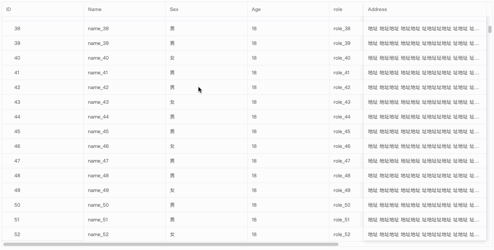
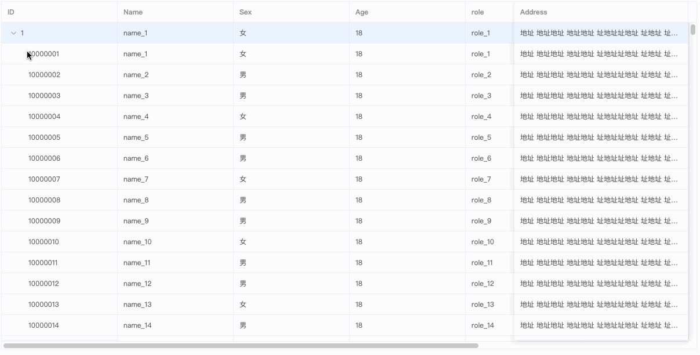
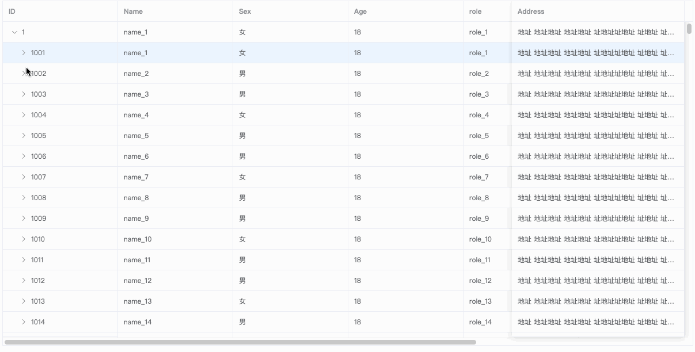

 # vbt-Table 
 ###### 一款基于element-ui(2.9.1)扩展的支持树形表格的大数据表格组件


#### 说明
- 渲染树形数据时，必须要指定 row-key和isTreeTable属性， row 中包含 children字段。
- 支持子节点数据异步加载。设置 Table 的 lazy 属性为 true 与加载函数 load 。通过指定 row 中的 hasChildren 字段来指定哪些行是包含子节点。
- children 与 hasChildren 都可以通过 tree-props 配置。
- 大数据滚动渲染需指定isBigData属性,支持树形表格大数据。
- 其它用法和elment-ui的table组件一样


#### 新增
- initParentFunc方法，用于初始化父级树形表格数据时处理数据，抛出当前处理的父级rowData

```
 // 设置父级初始值
    initParentFunc(row) {
      row.WRF_CHARSTC4 = ''
      row.parentShow = true

      let MENGETEXT = 0
      if (row.children && row.children.length) {
        row.disabled = true
        row.children.forEach(item => {
          if (item.MENGETEXT) MENGETEXT += Number(item.MENGETEXT)
        })
        row.MENGETEXT = MENGETEXT
      }

      if (row.NETPR) {
        row.BRTWR = (Number(row.MENGETEXT) * Number(row.NETPR)).toFixed(2)
      }
    },
```

- formateChildFunc方法，用于初始化子级树形表格数据时处理数据，抛出当前处理的子级rowData和parentRow


```
    formateChildFunc(row, parent) {
      row.disabled = true
      row.btnShow = true

      // 监听交货日期
      row.EEIND = parent.EEIND || ''

      row.WERKSNAME = parent.WERKSNAME || ''
      row.LGORTNAME = parent.LGORTNAME || ''

      if (parent.NETPR) {
        row.NETPR = Number(parent.NETPR).toFixed(2)
      }
      // 监听价格变化
      if (row.NETPR) {
        row.BRTWR = (Number(row.MENGETEXT) * Number(row.NETPR)).toFixed(2)
      }

      if (!row.UEBPO) row.UEBPO = parent.EBELP
    },
```


### 特性
##### 1.大数据支持
- 效果


##### 2.大数据树形表格支持
- 效果



##### 3.大数据树形表格懒加载支持
- 效果



```
<template>
    <vbt-table border
               stripe
               row-key="id"
               size="mini"
               isBigData
               lazy
               :load="load"
               highlight-hover-row
               max-height="600"
               :data="tableData">
      <vbt-table-column prop="id"
                        label="ID"
                        width="200"
                        fixed="left">
      </vbt-table-column>
      <vbt-table-column prop="name"
                        label="Name"
                        width="200">
      </vbt-table-column>
      <vbt-table-column prop="sex"
                        label="Sex"
                        width="200">
      </vbt-table-column>
      <vbt-table-column prop="age"
                        label="Age"
                        width="200">
      </vbt-table-column>
      <vbt-table-column prop="role"
                        label="role"
                        width="200">
      </vbt-table-column>
      <vbt-table-column prop="language"
                        label="language"
                        width="200">
      </vbt-table-column>
      <vbt-table-column prop="rate"
                        label="rate"
                        width="200">
      </vbt-table-column>
      <vbt-table-column prop="address"
                        label="Address"
                        fixed="right"
                        show-overflow-tooltip
                        min-width="300">
      </vbt-table-column>
    </vbt-table>
</template>

<script>
import {vbtTable,vbtTableColumn} from 'vbt-table'

function mockData(num, cId) {
  let fullIndex = 0
  const list = []
  for (let index = 0; index < num; index++) {
    fullIndex++
    cId && (cId = Number(cId) + 1)
    list.push({
      id: cId || fullIndex,
      hasChildren: cId > 1000000 ? false : true,
      // children: !cId ? mockData(30, `${fullIndex}0000000`) : [],
      role: 'role_' + fullIndex,
      language: index % 2 === 0 ? 'zh_CN' : 'en_US',
      name: 'name_' + fullIndex,
      sex: index % 3 ? '男' : '女',
      age: 18,
      rate: 5,
      address: `地址 地址地址 地址地址 址地址址地址 址地址 址地址  址地址 址地址  址地址 址地址址地址址地址 地址${index}`
    })
  }
  return list
}
export default {
  components: { vbtTable, vbtTableColumn },

  data() {
    return {
      tableData: mockData(1000)
    }
  },

  methods: {
    load(row, resolve) {
      setTimeout(() => {
        resolve(mockData(30, `${row.id}000`))
      }, 1000)
    }
  }
}
</script>

```

